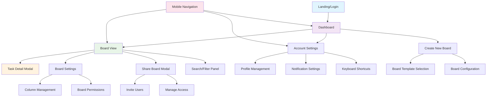
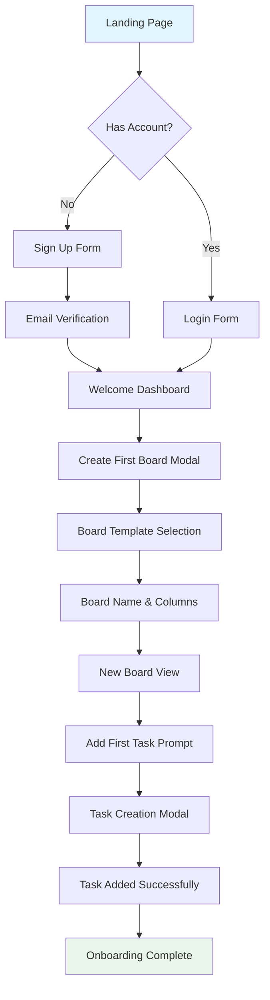
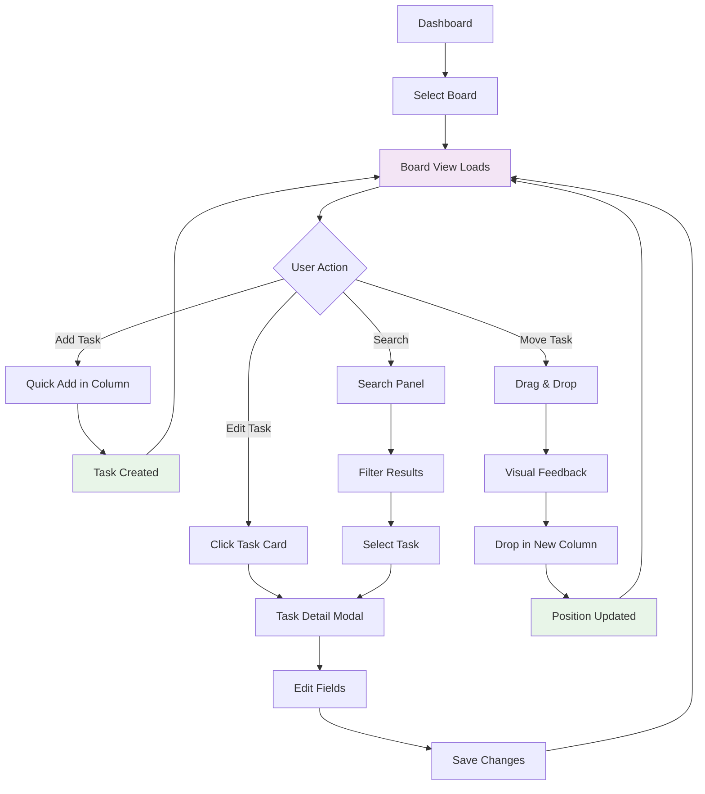
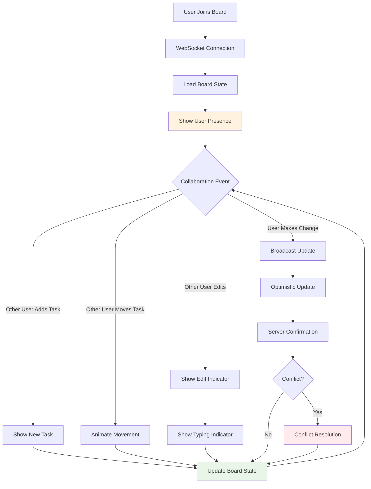

# Kanban Board Application UI/UX Specification

## Introduction

This document defines the user experience goals, information architecture, user flows, and visual design specifications for the Kanban Board Application's user interface. It serves as the foundation for visual design and frontend development, ensuring a cohesive and user-centered experience.

The application targets small development teams (3-10 members) and individual professionals who need efficient project organization without the complexity of enterprise tools or the limitations of basic to-do applications.

### Overall UX Goals & Principles

#### Target User Personas

**Primary: Small Development Team Members**
- Technical professionals working on multiple concurrent projects
- Need fast, efficient task management without context switching
- Value real-time collaboration and immediate feedback
- Expect keyboard shortcuts and power-user features
- Prefer clean, minimal interfaces over feature-heavy dashboards

**Secondary: Individual Professionals & Freelancers**
- Freelancers, consultants managing multiple client projects
- Need visual project overview and professional presentation
- Value simplicity and ease of use over advanced features
- Often work across different devices and locations
- Require reliable, accessible tools for client communication

#### Usability Goals

1. **Immediate Productivity:** New users can create their first board and add tasks within 2 minutes
2. **Efficient Workflow:** Power users can manage tasks using keyboard shortcuts and drag-and-drop without mouse dependency
3. **Real-time Confidence:** All users see changes immediately with clear visual feedback for collaboration
4. **Cross-device Consistency:** Users can seamlessly switch between desktop and mobile without losing functionality
5. **Cognitive Load Reduction:** Interface prioritizes essential information, hiding complexity until needed

#### Design Principles

1. **Speed Above All** - Every interaction must feel instantaneous; optimize for performance over visual flourishes
2. **Clarity Through Simplicity** - Use whitespace, clear typography, and minimal UI elements to reduce cognitive overhead
3. **Real-time Transparency** - Make collaboration visible through presence indicators, live updates, and change attribution
4. **Progressive Enhancement** - Core functionality works everywhere; advanced features enhance the experience
5. **Accessible by Design** - Full keyboard navigation, screen reader support, and high contrast built-in from day one

### Change Log
| Date | Version | Description | Author |
|------|---------|-------------|---------|
| 2025-01-03 | 1.0 | Initial front-end specification creation | UX Expert |

## Information Architecture (IA)

### Site Map / Screen Inventory

### Navigation Structure

**Primary Navigation:**
- **Desktop:** Top navigation bar with logo, board switcher, search, user menu, and real-time collaboration indicators
- **Mobile:** Bottom tab bar with Dashboard, Current Board, Search, and Profile tabs
- **Breadcrumbs:** Dashboard > Board Name > (Task Name when modal open)

**Secondary Navigation:**
- **Board-level:** Floating action buttons for common actions (Add Task, Board Settings, Share)
- **Context menus:** Right-click/long-press menus for task and column actions
- **Keyboard shortcuts:** Accessible via '?' key for help overlay

**Breadcrumb Strategy:**
- Always show current location: Dashboard > Board Name
- Include board switching without returning to dashboard
- Show task context when detail modal is open
- Maintain navigation state during real-time collaboration

## User Flows

### Flow 1: First-Time User Onboarding

**User Goal:** New user creates account and first kanban board
**Entry Points:** Landing page, signup link, invitation email
**Success Criteria:** User has created account, first board, and added at least one task

**Flow Diagram:**

**Edge Cases & Error Handling:**
- Email already exists → Show login option with "forgot password" link
- Email verification fails → Resend verification with clear instructions
- Board creation fails → Show error message, allow retry with saved data
- Network interruption → Save draft locally, sync when reconnected

### Flow 2: Daily Task Management

**User Goal:** User manages tasks on existing board throughout workday
**Entry Points:** Dashboard, direct board URL, mobile app
**Success Criteria:** User can quickly add, edit, move, and complete tasks

**Flow Diagram:**

**Edge Cases & Error Handling:**
- Drag operation fails → Revert to original position, show error toast
- Simultaneous edits → Show conflict resolution dialog
- Network disconnection → Queue changes locally, show offline indicator
- Task save fails → Preserve user input, retry automatically

### Flow 3: Real-time Collaboration

**User Goal:** Multiple team members collaborate on shared board simultaneously
**Entry Points:** Shared board invitation, direct board access
**Success Criteria:** Users see real-time updates and can collaborate without conflicts

**Flow Diagram:**

**Edge Cases & Error Handling:**
- Connection lost → Show offline mode, queue changes for sync
- Conflict resolution → Show both versions, allow user to choose
- Too many simultaneous users → Implement graceful degradation
- Server overload → Show performance warning, suggest refresh

## Wireframes & Mockups

### Primary Design Files
**Design Tool:** Figma (recommended for collaborative design and developer handoff)
**File Structure:** Kanban Board App - UI/UX Specification

### Key Screen Layouts

#### Dashboard (Board List)
**Purpose:** Central hub for accessing and managing all user boards

**Key Elements:**
- Header with logo, global search, user avatar, and notifications
- "Create New Board" prominent call-to-action button
- Board grid with cards showing: board name, last modified, task count, collaborator avatars
- Recent boards section for quick access
- Filter/sort options (by date, name, activity)
- Empty state with onboarding guidance for new users

**Interaction Notes:** Hover states reveal board actions (share, duplicate, delete). Quick board creation modal. Keyboard navigation support.

#### Kanban Board View
**Purpose:** Primary workspace for task management and collaboration

**Key Elements:**
- Board header with title, share button, settings, and real-time user presence indicators
- Customizable columns with headers (To Do, In Progress, Done, etc.)
- Task cards with title, description preview, due date, priority indicator, and assignee
- "Add Task" buttons in each column
- Floating search/filter panel (collapsible)
- Drag-and-drop visual feedback zones

**Interaction Notes:** Smooth drag-and-drop with ghost images and drop zones. Real-time updates with subtle animations. Keyboard shortcuts for power users.

#### Task Detail Modal
**Purpose:** Focused editing experience for comprehensive task management

**Key Elements:**
- Large title field with auto-resize
- Rich text description editor
- Due date picker with calendar widget
- Priority level selector (High, Medium, Low)
- Assignment dropdown with user search
- Activity/comment stream for collaboration
- Save/Cancel actions with keyboard shortcuts
- Delete option with confirmation

**Interaction Notes:** Auto-save functionality. Real-time collaboration indicators. Accessible form validation. Modal can be resized/maximized.

---

*Note: This specification continues with detailed sections on Component Library, Branding & Style Guide, Accessibility Requirements, Responsiveness Strategy, Animation & Micro-interactions, Performance Considerations, and Next Steps. The complete specification provides comprehensive guidance for frontend development and design implementation.*
